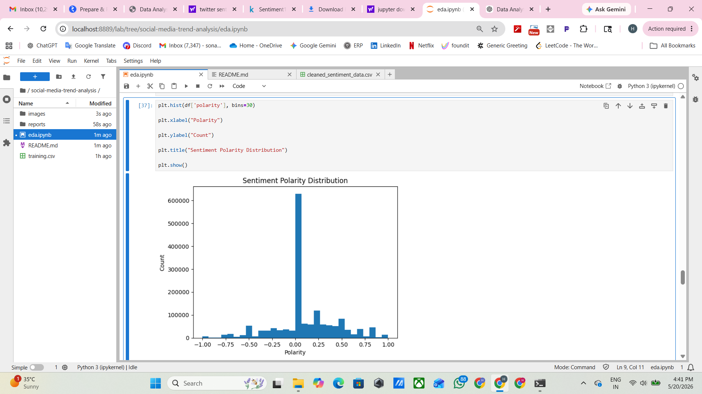
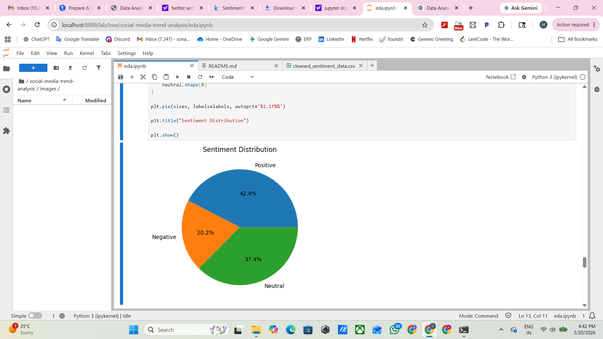

# Social Media Trend Analysis

## Project Overview
This project analyzes social media tweets and identifies sentiment trends using NLP techniques.

## Features
- Tweet Cleaning
- Stopword Removal
- Sentiment Analysis
- Polarity Scoring
- Data Visualization

## Technologies Used
- Python
- Pandas
- NLTK
- TextBlob
- Matplotlib

## Dataset
Twitter Sentiment Dataset

## Output
- Positive Tweets
- Negative Tweets
- Neutral Tweets
- Sentiment Distribution Visualization

## Project Screenshots

### Sentiment Polarity Distribution

### Sentiment Distribution Pie Chart
