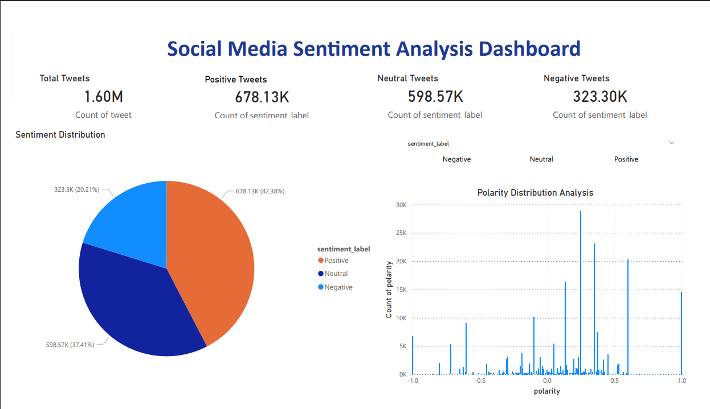
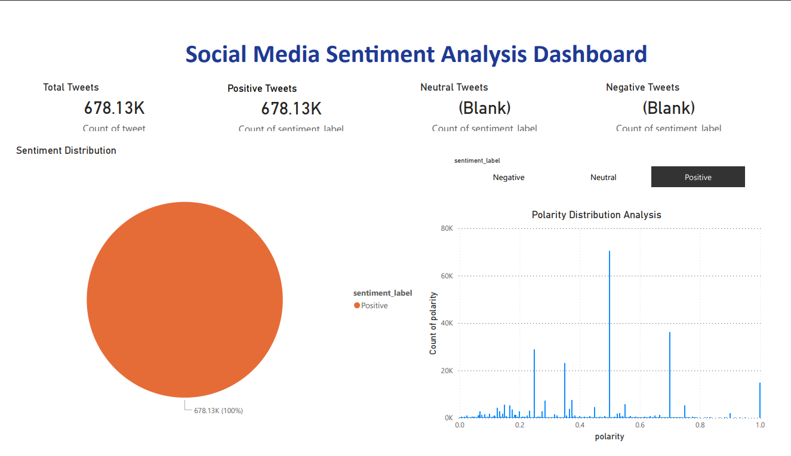
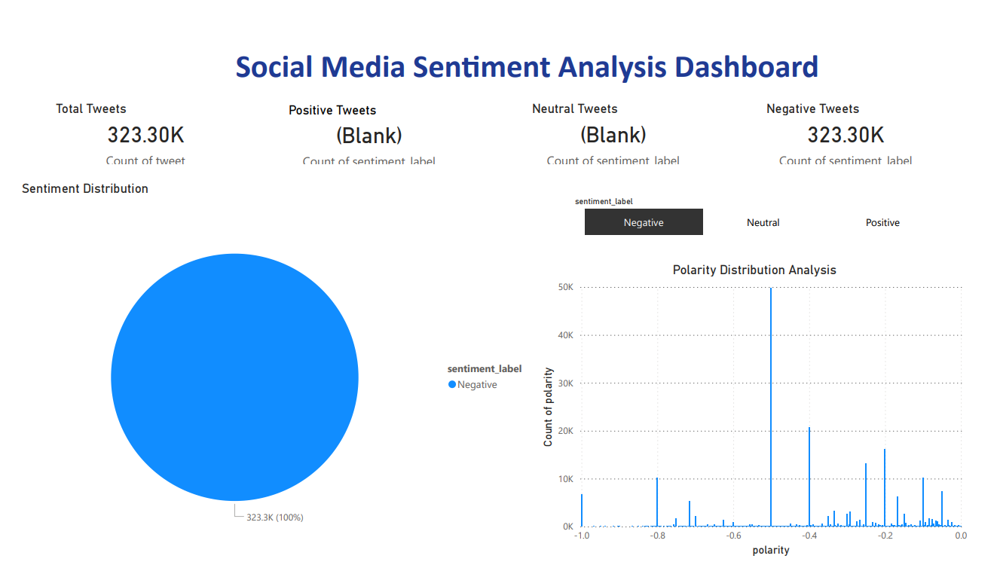
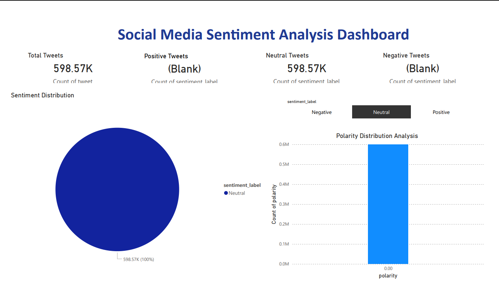

# Social Media Trend Analysis

## Project Overview
This project analyzes social media tweets and identifies sentiment trends using NLP techniques.

## Features
- Tweet Cleaning
- Stopword Removal
- Sentiment Analysis
- Polarity Scoring
- Data Visualization

## Technologies Used
- Python
- Pandas
- NLTK
- TextBlob
- Matplotlib

## Dataset
Twitter Sentiment Dataset

## Output
- Sentiment Distribution Visualization
- Polarity Histogram Visualization
- Positive Tweets
- Negative Tweets
- Neutral Tweets

## Dashboard Screenshots

### Sentiment Pie Chart

### Polarity Histogram

### Main Dashboard

### Positive Sentiment Analysis

### Negative Sentiment Analysis

### Neutral Sentiment Analysis

## Future Improvements
- Real-time Twitter API integration
- Advanced NLP models
- Interactive Dashboard using Power BI or Streamlit
- Multi-language sentiment analysis